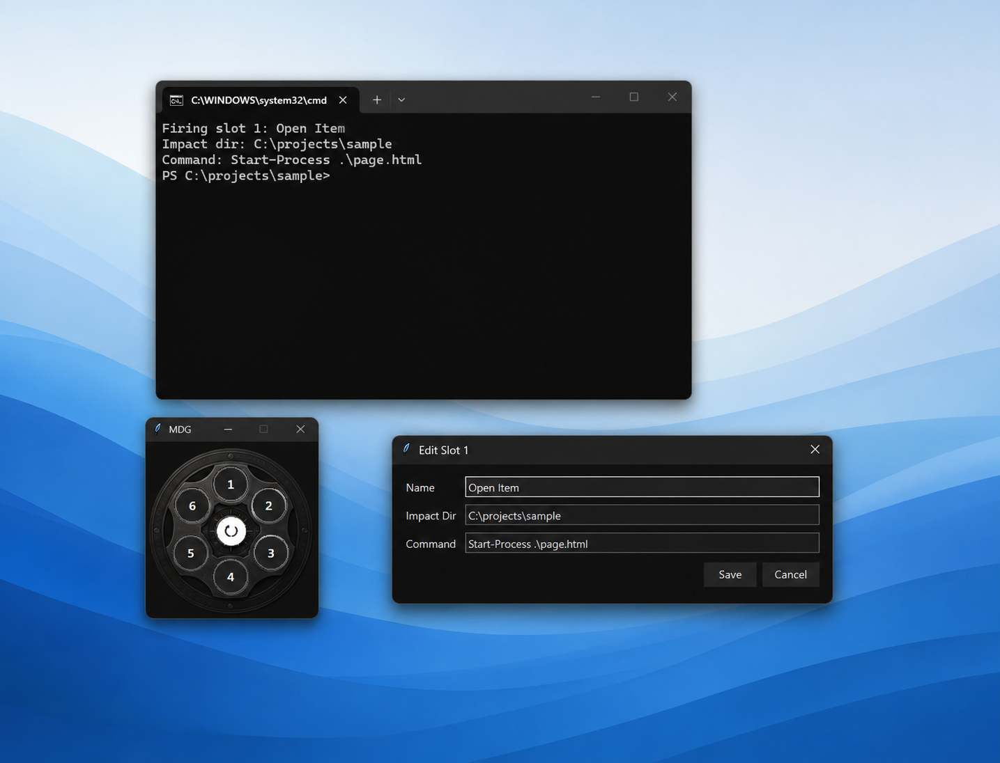

# Magic Revolver (MDG)

Magic Revolver (MDG) is a lightweight desktop launcher built around a six-slot revolver interface.

Each chamber acts as a spell slot that can store and fire local commands.

MDG is designed for fast local workflow execution, project launching, and tool orchestration.



## Features

- 6 fixed spell slots
- Revolver-style GUI
- Double-click command firing
- Right-click slot editing
- Fire logging
- Saved spellbooks
- Optional local fire sound
- Always-on-top by default
- Lightweight local operation
- PowerShell-friendly workflow

## Files

- `revolver_gui.py`
  Desktop GUI.

- `revolver.py`
  Command runner and log writer.

- `spells.json`
  Local slot configuration. Keep this file private when it contains personal paths or commands.

- `spells.example.json`
  Public-safe sample slot configuration.

- `spellbooks/`
  Saved slot profiles. Loading a book copies it into `spells.json`.

- `assets/revolver_bg.png`
  Optional GUI background image.

- `assets/fire.wav`
  Optional local firing sound. This file is ignored by Git and should be supplied by each user.

- `logs/`
  Fire history.

## Usage

Start GUI:

```powershell
py revolver_gui.py
```

Initialize config:

```powershell
py revolver.py init
```

List slots:

```powershell
py revolver.py list
```

Fire slot:

```powershell
py revolver.py fire 1
```

Edit config:

```powershell
py revolver.py edit
```

List spellbooks:

```powershell
py revolver.py list-books
```

Load a spellbook:

```powershell
py revolver.py load-book default
```

Save the active slots as a spellbook:

```powershell
py revolver.py save-book daily
```

## Codex-style instruction sample

MDG works best when command preparation and command execution stay separate.

You can give an AI assistant a short instruction like this:

```txt
Read the project instructions first.
Prepare safe, readable MDG slots for the active project.
Use six slots as a small command magazine.
Avoid destructive or external-impact commands unless explicitly requested.
After changing a slot, report the slot number, directory, command, and risk.
The operator reviews and fires slots from the GUI.
```

This is only a usage pattern. Review every command before firing it.

## Slot config

Example:

```json
{
  "name": "Run App",
  "impact_dir": "E:/your_project",
  "command": ".\\.venv\\Scripts\\python.exe app.py"
}
```

## GUI controls

* Single click: select slot
* Double click: fire slot
* Right click: edit slot
* Center click: reload
* Center middle click: toggle always-on-top
* Center right click: spellbook menu

MDG starts as an always-on-top window so it can stay visible while working in other apps.
Use center middle click if you want to turn always-on-top off or on again.

Right-clicking a slot opens a compact editor for the slot name, working directory, and command.

## Spellbooks

MDG keeps `spells.json` as the active runtime config.

Saved profiles live in:

```txt
spellbooks/
```

Loading a spellbook copies `spellbooks/<name>.json` to `spells.json`.
Saving a spellbook copies the current `spells.json` to `spellbooks/<name>.json`.

Spellbook names may use Japanese filenames, but path traversal and unsafe filename characters are rejected.

## Visual customization

The GUI can use a custom background image.

Place a PNG at:

```txt
assets/revolver_bg.png
```

Transparent PNGs work well because the window background color can still show through.

Slot button positions are defined in `revolver_gui.py`:

```python
SLOTS = {
    1: (109, 52),
    2: (155, 78),
    3: (159, 136),
    4: (109, 166),
    5: (60, 137),
    6: (63, 78),
}
```

Adjust these coordinates when your background art uses a different chamber layout.

## Optional sound

When a slot is fired from the GUI, MDG plays a short sound.

If this file exists, MDG uses it:

```txt
assets/fire.wav
```

If it does not exist, MDG falls back to a standard Windows notification sound.

Sound files are not included in this repository. Add your own local `assets/fire.wav` if you want a custom firing sound, and make sure you have the right to use that sound.

## Command safety

MDG runs slot commands through PowerShell on Windows.

Treat each slot as a visible command, not hidden automation.
Review commands before firing them, especially commands that modify files, change Git history, upload data, edit credentials, or remove content.

## Note

MDG is designed as a lightweight local command launcher.

For public sharing, prefer committing `spells.example.json` and keeping `spells.json`, logs, and generated caches local.

## License

MIT License
